# Draughts. Requisitos Básica
Universo Santa Tecla  
[uSantaTecla@gmail.com](mailto:uSantaTecla@gmail.com)

**Índice**

1. [Requisitos](#requisitos)
2. [Vista de Casos de Uso](#vista-de-casos-de-uso)  
   2.1. [Vista de Caso de Uso Start](#vista-de-caso-de-uso-start)  
   2.2. [Vista de Caso de Uso Move Piece](#vista-de-caso-de-uso-move-piece)  
   2.3. [Vista de Caso de Uso Resume](#vista-de-caso-de-uso-resume)   
   2.4. [Prototipo de Interfaz](#prototipo-de-interfaz)  
3. [Analisis](#analisis)  
   3.1. [Analisis de Paquetes](#analisis-de-paquetes)  
   3.2. [Analisis de la Arquitectura](#analisis-de-la-arquitectura)  
   3.3. [Analisis de cada paquete](#analisis-de-cada-paquete)  
   3.3.1. [Vistas](#vistas)  
   3.3.2. [Controladores](#controladores)  
   3.3.3. [Modelos](#modelos)  
   3.3.3. [Tipos](#tipos)  
   3.4. [Analisis de los Casos de Uso](#analisis-de-los-casos-de-uso)  
   3.4.1. [Analisis Start](#analisis-start)  
   3.4.2. [Analisis Mover_Pieza](#analisis-move-piece)  
   3.4.3. [Analisis Resume](#analisis-resume)
4. [Diseño](#diseño)   
   4.1. [Vista de despliegue](#vista-de-despliegue)  
   4.2. [Vista de participantes](#vista-de-participantes)  
   4.3. [Vista de interacción de participantes](#vista-de-interaccin-de-participantes)
## Requisitos

| [Wiki](https://en.wikipedia.org/wiki/Mastermind_(board_game)) - [Youtube](https://www.youtube.com/watch?v=r-7R2sCW3Ro&ab_channel=wikiHow)<br/> * _Funcionalidad: **Básica**_<br/>  * _Interfaz: **Texto**_<br/>  * _Distribución: **Standalone**_<br/>  * _Persistencia: **No**_<br/> |  | 
| :------- | :------: |  

## Vista de Casos de Uso

| Diagrama de Actores y Casos de Uso | Diagrama de Contexto |
|---|---|
| 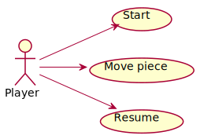 | 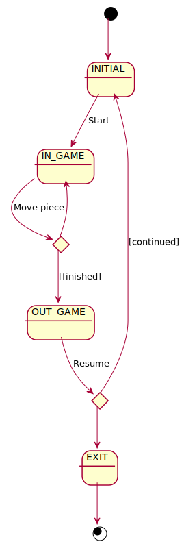 |  

## Vista de Caso de Uso Start
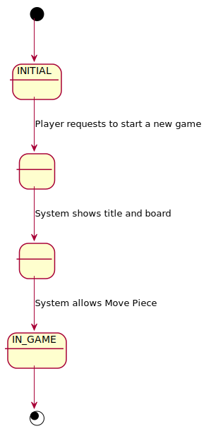

## Vista de Caso de Uso Move Piece
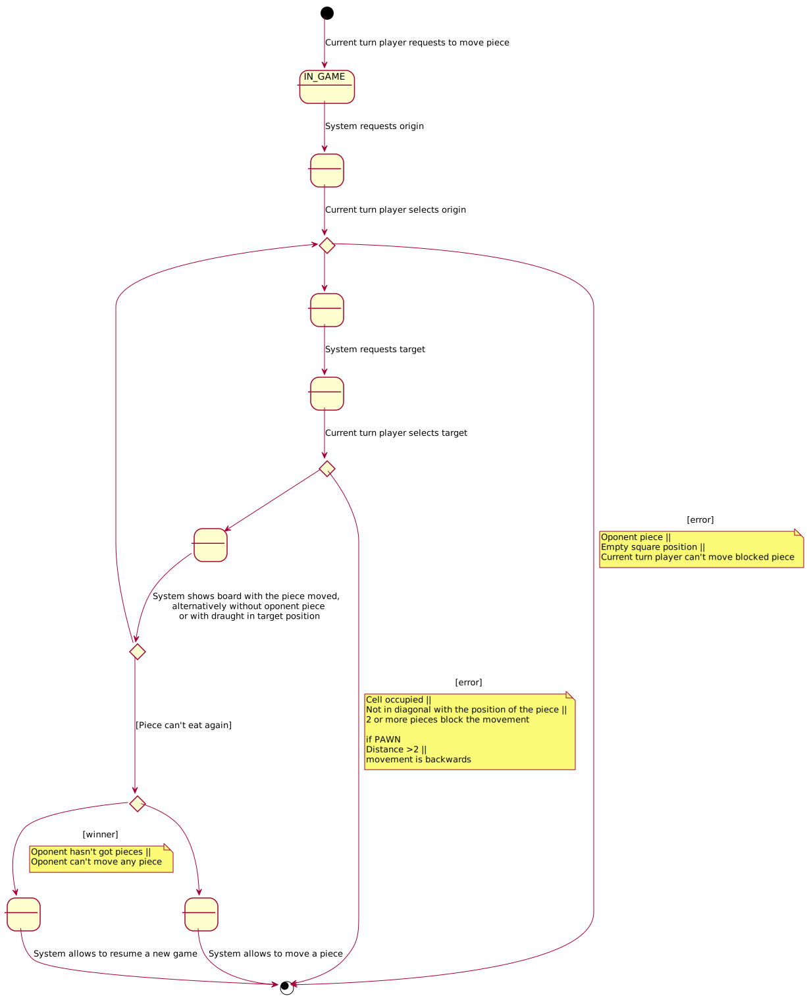

## Vista de Caso de Uso Resume
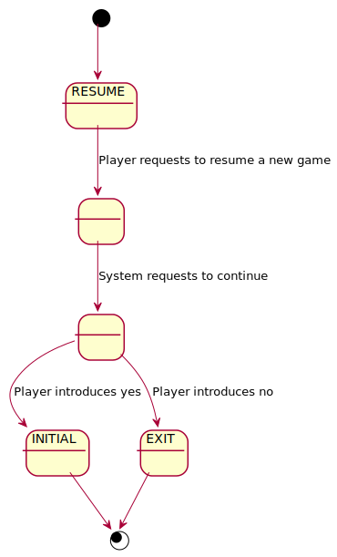

### Prototipo de Interfaz

```
     ------- Draughts -------
 |   | b |   | b |   | b |   | b |
 | b |   | b |   | b |   | b |   |
 |   | b |   | b |   | b |   | b |
 |   |   |   |   |   |   |   |   |
 |   |   |   |   |   |   |   |   |
 | w |   | w |   | w |   | w |   |
 |   | w |   | w |   | w |   | w |
 | w |   | w |   | w |   | w |   |
Origin coordinate to move
Row: 6
Column: 1
Target coordinate to move
Row: 5
Column: 2
 |   | b |   | b |   | b |   | b |
 | b |   | b |   | b |   | b |   |
 |   | b |   | b |   | b |   | b |
 |   |   |   |   |   |   |   |   |
 |   | w |   |   |   |   |   |   |
 |   |   | w |   | w |   | w |   |
 |   | w |   | w |   | w |   | w |
 | w |   | w |   | w |   | w |   |
Origin coordinate to move
Row: 3
Column: 2
Target coordinate to move
Row: 4
Column: 3
 |   | b |   | b |   | b |   | b |
 | b |   | b |   | b |   | b |   |
 |   |   |   | b |   | b |   | b |
 |   |   | b |   |   |   |   |   |
 |   | w |   |   |   |   |   |   |
 |   |   | w |   | w |   | w |   |
 |   | w |   | w |   | w |   | w |
 | w |   | w |   | w |   | w |   | 
```
## Analisis  

### Analisis de paquetes
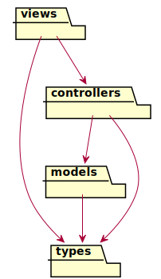

### Analisis de la Arquitectura
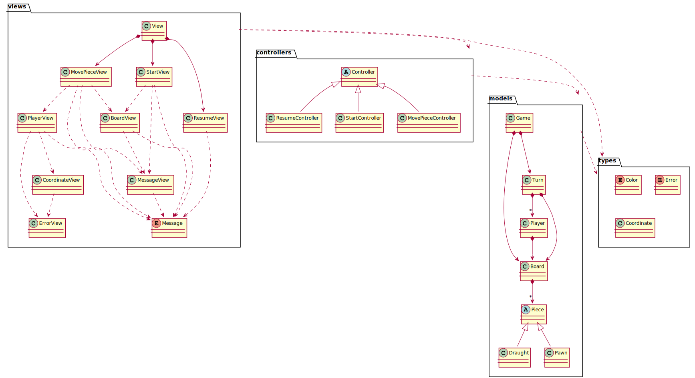

### Analisis de cada paquete

#### Vistas
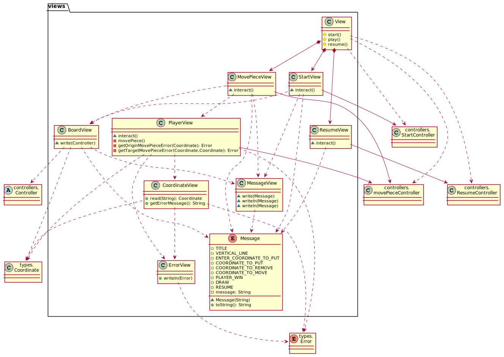

#### Controladores


#### Modelos
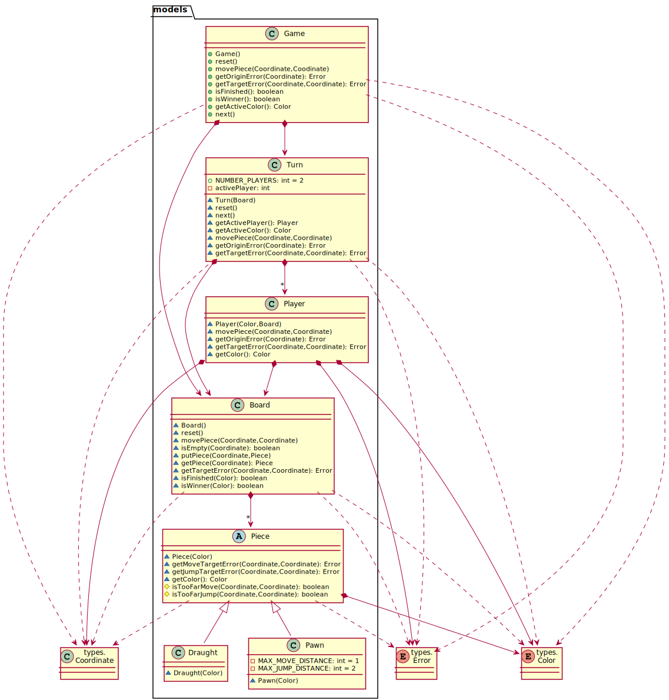

#### Tipos
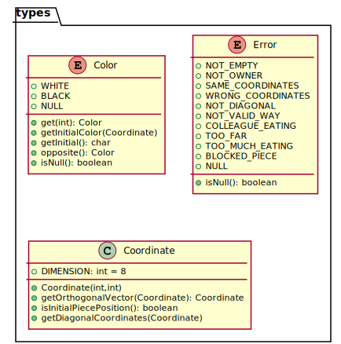

### Analisis de los Casos de Uso

#### Analisis Start
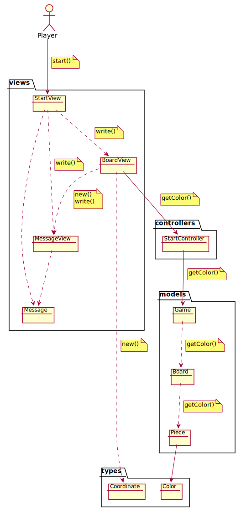

#### Analisis Move Piece
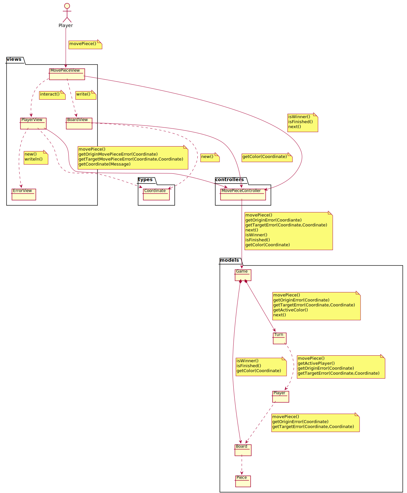

#### Analisis Resume
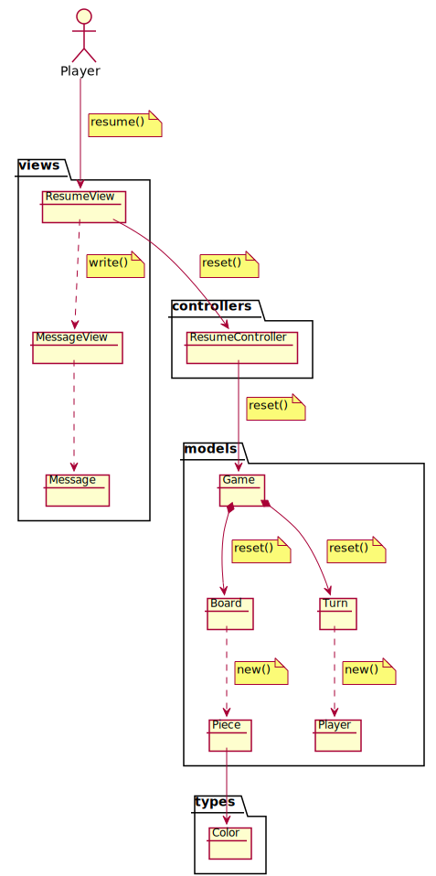

## Diseño

### Vista de despliegue
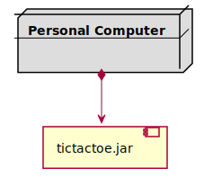

### Vista de participantes
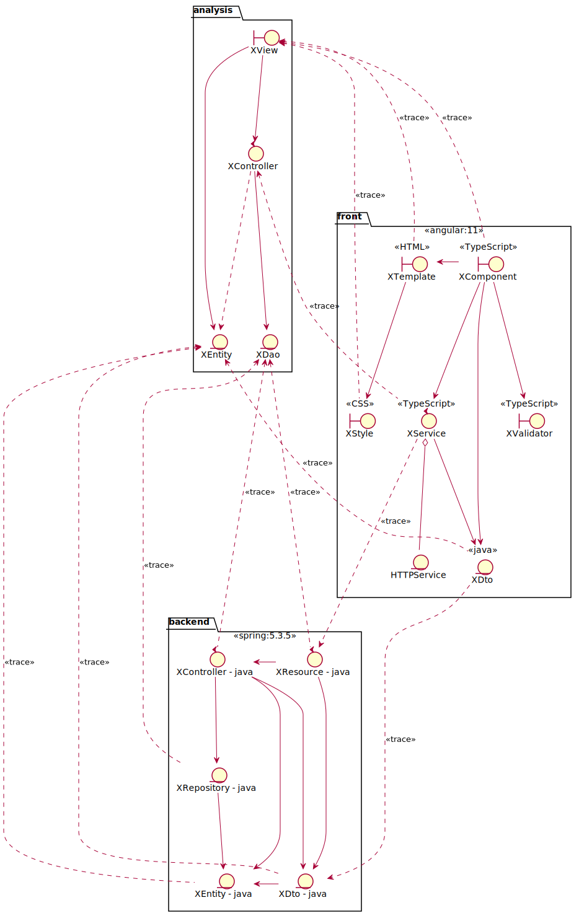

### Vista de interacción de participantes
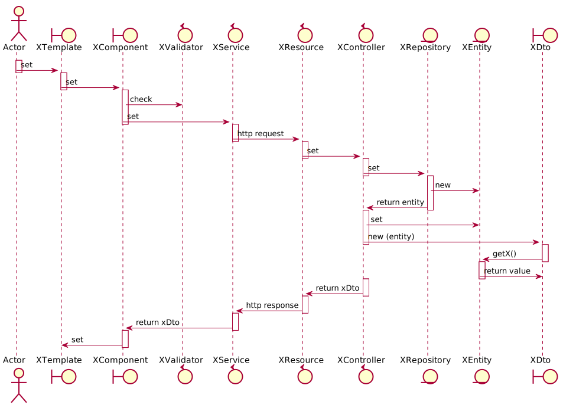
