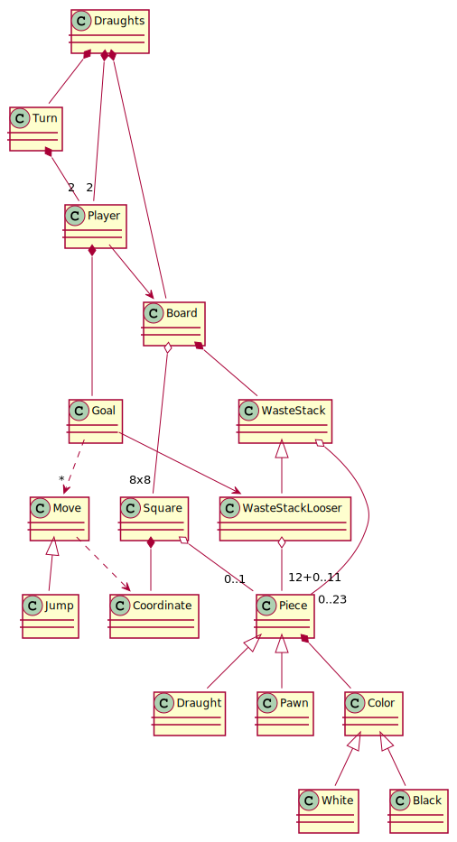
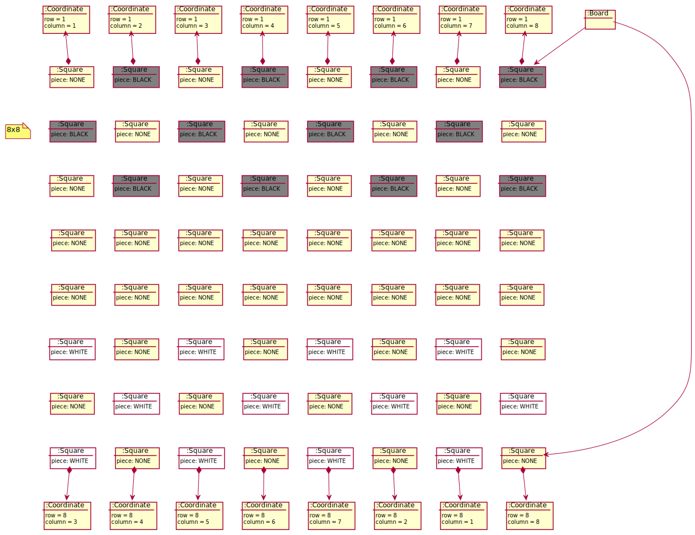
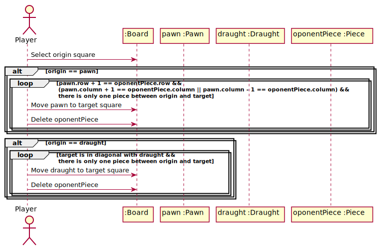

# Draughts
Universo Santa Tecla  
[uSantaTecla@gmail.com](mailto:uSantaTecla@gmail.com)

**Índice**

1. [Modelo del dominio](#modelo-del-dominio)  
   1.1. [Vocabulario](#vocabulario)  
   1.2. [Estado inicial](#estado-inicial)  
   1.3. [Secuencia comer pieza](#secuencia-comer-pieza)

## Modelo del dominio

### Vocabulario

### Estado inicial

### Secuencia comer pieza

  
